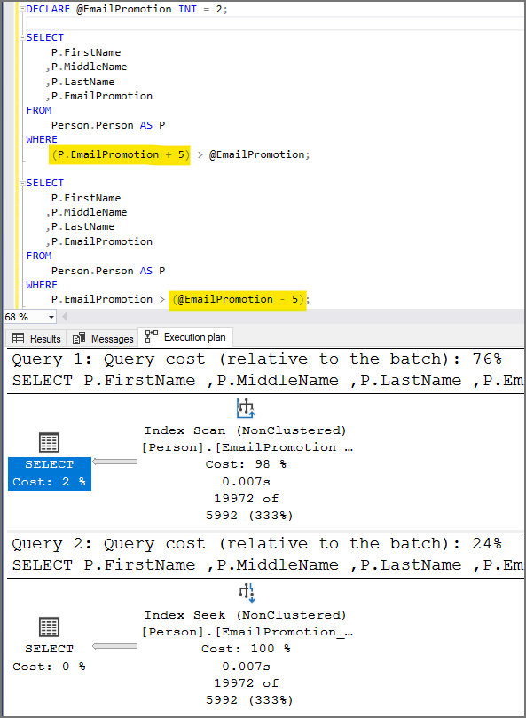
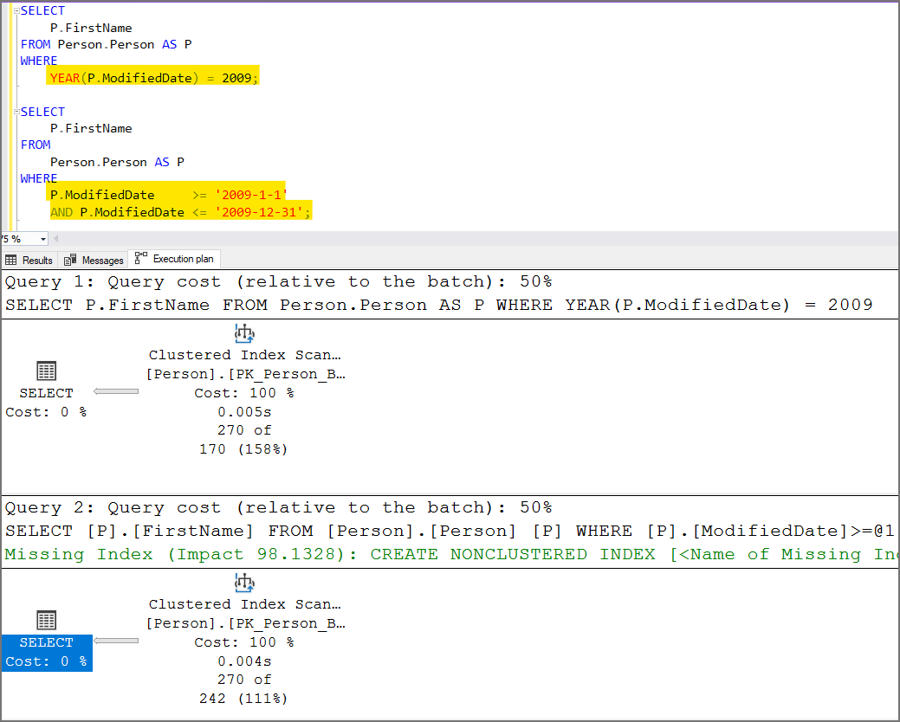
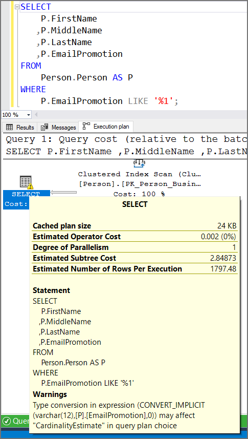

# SQL Code Conventions
{: .no_toc }
T-SQL code must execute properly and performant. It must be readable, well laid out and it must be robust and resilient. It must not rely on deprecated features of SQL Server or assume specific database settings.

---

<details open markdown="block">
  <summary>
    Table of contents
  </summary>
  {: .text-delta }
1. TOC
{:toc}
</details>
[Back to top](#top)

---

## Not Using Source Control
**Check Id:** [None yet, click here to view the issue](https://github.com/EmergentSoftware/SQL-Server-Development-Assessment/issues/161)

Your database objects (tables, views, stored procedures, functions, triggers, users, roles, schemas, static data, ...) should be in a version control system. 

Source control lets you see who made what changes, when, and why. Automate SQL changes during deployment. Rollback any changes you don't want. Source control helps when you develop branch features.

Most importantly, you work from a single source of truth, greatly reducing the risk of downtime at deployment.


[Redgate SQL Source Control](https://www.red-gate.com/products/sql-development/sql-source-control/) is our tool of choice.

[Back to top](#top)

---

## Data Warehouse Date & Time Key Pattern
**Check Id:** [None yet, click here to view the issue](https://github.com/EmergentSoftware/SQL-Server-Development-Assessment/issues/155)

This data warehouse date & time key pattern can be used with the [Date-Time-Dimensions](https://github.com/EmergentSoftware/Date-Time-Dimensions) tables. The grain of the time dimension records are in seconds.

The primary keys in the date and time dimension tables are integers and the T-SQL below extracts and converts them.

If the datetime column in the source table is a DATETIMEOFFSET data type you can remove the first 'AT TIME ZONE'.

See [Using DATETIME Instead of DATETIMEOFFSET](/SQL-Server-Development-Assessment/findings/data-type-conventions#using-datetime-instead-of-datetimeoffset).

```sql
SELECT
    [Date Key] = 
		ISNULL(
			CAST(
				CONVERT(CHAR(8), 
					CAST(
						CAST(
							GETDATE() AS DATETIME2(7) /* use the table date column instead of GETDATE() here */
						) 
						AT TIME ZONE 'UTC' /* use this 1st AT TIME ZONE to set the offset if the data type is not using datetimeoffset(7) */
						AT TIME ZONE 'Central Standard Time' /* this 2nd AT TIME ZONE converts into the time zone */
						AS DATETIME
					), 112
				) AS INT
			), -1
		)
   ,[Time Key] = 
		REPLACE(
			CONVERT(VARCHAR(8), 
				CAST(
					CAST(
						GETDATE() AS DATETIME2(7) /* use the table date column instead of GETDATE() here */
					) 
					AT TIME ZONE 'UTC' /* use this 1st AT TIME ZONE to set the offset if the data type is not using datetimeoffset(7) */
					AT TIME ZONE 'Central Standard Time' AS TIME /* this 2nd AT TIME ZONE converts into the time zone */
				), 108
			), ':', ''
		);
```

[Back to top](#top)

---

## UPSERT Pattern
**Check Id:** [None yet, click here to view the issue](https://github.com/EmergentSoftware/SQL-Server-Development-Assessment/issues/151)

**Use this UPSERT pattern when a record update is more likely:** Don't worry about checking for a records existence just perform the update.

```sql
BEGIN TRANSACTION;

UPDATE
    dbo.Person WITH (UPDLOCK, SERIALIZABLE)
SET
    FirstName = 'Kevin'
WHERE
    LastName = 'Martin';

IF @@ROWCOUNT = 0
    BEGIN
        INSERT dbo.Person (FirstName, LastName) VALUES ('Kevin', 'Martin');
    END;

COMMIT TRANSACTION;
```


**Use this UPSERT pattern when a record insert is more likely:** Don't worry about checking for a records existence just perform the insert.

```sql
BEGIN TRANSACTION;

INSERT dbo.Person (FirstName, LastName)
SELECT
    'Kevin'
   ,'Martin'
WHERE
    NOT EXISTS (
    SELECT
        1
    FROM
        dbo.Person WITH (UPDLOCK, SERIALIZABLE)
    WHERE
        LastName = 'Martin'

COMMIT TRANSACTION;
);

IF @@ROWCOUNT = 0
    BEGIN
        UPDATE dbo.Person SET FirstName = 'Kevin' WHERE LastName = 'Martin';
    END;
```

**Use this UPSERT pattern to allow the client application to handle the exception:** Ensure you handle the exception in your code.

```sql
BEGIN TRANSACTION;

BEGIN TRY
    INSERT dbo.Person (FirstName, LastName) VALUES ('Kevin', 'Martin');
END TRY
BEGIN CATCH
    UPDATE dbo.Person SET FirstName = 'Kevin' WHERE LastName = 'Martin';
    THROW;
END CATCH;

COMMIT TRANSACTION;
```


**Use this UPSERT pattern for upserting multiple rows:** You can use a [table-valued parameter](https://docs.microsoft.com/en-us/sql/relational-databases/tables/use-table-valued-parameters-database-engine?view=sql-server-ver15), [JSON](https://docs.microsoft.com/en-us/sql/relational-databases/json/convert-json-data-to-rows-and-columns-with-openjson-sql-server?view=sql-server-ver15), [XML](https://docs.microsoft.com/en-us/sql/t-sql/xml/nodes-method-xml-data-type?view=sql-server-ver15) or [comma-separated list](https://docs.microsoft.com/en-us/sql/t-sql/functions/string-split-transact-sql?view=sql-server-ver15). 

For JSON, XML or comma-separated list ensure you insert the records into a temporary table for performance considerations.

```sql
BEGIN TRANSACTION;

CREATE TABLE #Update (FirstName VARCHAR(50) NOT NULL, LastName VARCHAR(50) NOT NULL);

INSERT INTO #Update (FirstName, LastName)
VALUES
     ('Kevin', 'Martin')
    ,('Jean-Luc', 'Picard');

UPDATE
    P WITH (UPDLOCK, SERIALIZABLE)
SET
    P.FirstName = U.FirstName
FROM
    dbo.Person         AS P
    INNER JOIN #Update AS U ON P.LastName = U.LastName;

INSERT dbo.Person (FirstName, LastName)
SELECT
    U.FirstName
   ,U.LastName
FROM
    #Update AS U
WHERE
    NOT EXISTS (SELECT * FROM dbo.Person AS P WHERE P.LastName = U.LastName);

COMMIT TRANSACTION;
```


**Do not use this UPSERT pattern:** It will produce primary key violations when run concurrently.

```sql
IF EXISTS (SELECT * FROM dbo.Person AS P WHERE P.LastName = 'Martin')
    BEGIN
        UPDATE dbo.Person 
		SET FirstName = 'Kevin' 
		WHERE LastName = 'Martin';
    END;
ELSE
    BEGIN
        INSERT dbo.Person (FirstName, LastName) 
		VALUES ('Kevin', 'Martin');
    END;
```

**Do not use this UPSERT pattern:** It will produce primary key violations when run concurrently. MERGE can be used for ETL processing if it is assured to NOT be run concurrently.

```sql
MERGE INTO dbo.Person AS T
USING (
	SELECT FirstName = 'Kevin', LastName = 'Martin'
) AS S
ON (S.LastName = T.LastName)
WHEN MATCHED THEN
    UPDATE SET
        FirstName = S.FirstName
WHEN NOT MATCHED THEN
    INSERT (FirstName, LastName)
    VALUES
         (S.FirstName, S.LastName);
```

[Back to top](#top)

---


## Using ORDER BY
**Check Id:** [None yet, click here to view the issue](https://github.com/EmergentSoftware/SQL-Server-Development-Assessment/issues/39)

SQL Server is the second most expensive sorting system, remind the developer they can sort in the application layer

**2020 Pricing**

- Oracle Enterprise Edition = $47,500 per core
- Microsoft SQL Server Enterprise Edition = $7,128 per core 
- ⬇
- Microsoft Access $159.99

[Back to top](#top)

---

## Cursors
**Check Id:** [None yet, click here to view the issue](https://github.com/EmergentSoftware/SQL-Server-Development-Assessment/issues/25)


#### Overview
Even though you'll hear DBAs and other experts say, "never use cursors!", there are a few cases were cursors come in handy and there are a few important pointers.

SQL Server originally supported cursors to more easily port dBase II applications to SQL Server, but even then, you can sometimes use a `WHILE` loop (See [Using WHILE Loop](#using-while-loop)) as an effective substitute. Modern versions of SQL Server provide window functions and the CROSS/OUTER APPLY syntax to cope with some of the traditional valid uses of the cursor.

#### Valid Use Cases
- Executing a complex stored procedure or series of stored procedures based on a set of data. It is true this can be handled with a `WHILE` loop and grabbing each record from the database, but a read-only, fast-forward cursor well and can be easier to manage.
- Import scripts

#### Cursor Type
It is likely a bad idea to use any cursor other than one that is read-only and fast-forward. However, you need to declare your cursor correctly in order to create the right type:
`DECLARE MyCursor CURSOR LOCAL FAST_FORWARD FOR`

#### Full Cursor Syntax

```sql
DECLARE
    @MyId          INT
   ,@MyName        NVARCHAR(50)
   ,@MyDescription NVARCHAR(MAX);

DECLARE MyCursor CURSOR LOCAL FAST_FORWARD FOR
SELECT
    MT.MyId
   ,MT.MyName
   ,MT.MyDescription
FROM
    dbo.MyTable AS MT
WHERE
    MT.DoProcess = 1;

OPEN MyCursor;

FETCH NEXT FROM MyCursor
INTO
    @MyId
   ,@MyName
   ,@MyDescription;

WHILE @@FETCH_STATUS = 0
    BEGIN
        --Do something or a series of things for each record
        DECLARE @Result INT;
        EXEC @Result = dbo.SomeStoredProcedure @MyId = @MyId;

        FETCH NEXT FROM MyCursor
        INTO
            @MyId
           ,@MyName
           ,@MyDescription;
    END;

CLOSE MyCursor;
DEALLOCATE MyCursor;
```

[Back to top](#top)

---

## Using WHILE Loop
**Check Id:** [None yet, click here to view the issue](https://github.com/EmergentSoftware/SQL-Server-Development-Assessment/issues/27)

`WHILE` loop is really a type of cursor. Although a `WHILE` loop can be useful for several inherently procedural tasks, you can usually find a better relational way of achieving the same results. The database engine is heavily optimized to perform set-based operations rapidly.

Here is a `WHILE` loop pattern. You might be able to create a SQL statement that does a bulk update instead.

```sql
CREATE TABLE #Person (
    PersonId        INT           NOT NULL IDENTITY(1, 1) PRIMARY KEY
   ,FirstName       NVARCHAR(100) NOT NULL
   ,LastName        NVARCHAR(128) NOT NULL
   ,IsProcessedFlag BIT           NOT NULL DEFAULT (0)
);

INSERT INTO
    #Person (FirstName, LastName, IsProcessedFlag)
VALUES
     (N'Joel', N'Miller', 0);

DECLARE
    @PersonId  INT
   ,@FirstName NVARCHAR(100)
   ,@LastName  NVARCHAR(100);

WHILE EXISTS (SELECT * FROM #Person WHERE IsProcessedFlag = 0)
    BEGIN
        SELECT TOP (1)
               @PersonId  = P.PersonId
              ,@FirstName = P.FirstName
              ,@LastName  = P.LastName
        FROM
            #Person AS P
        WHERE
            P.IsProcessedFlag = 0
        ORDER BY
            P.PersonId;

        UPDATE
            dbo.Person
        SET
            FirstName = @FirstName
           ,LastName = @LastName
        WHERE
            PersonId = @PersonId;

        UPDATE #Person SET IsProcessedFlag = 1 WHERE PersonId = @PersonId;
    END;
```

[Back to top](#top)

---

## Temporary Tables and Table Variables
**Check Id:** [None yet, click here to view the issue](https://github.com/EmergentSoftware/SQL-Server-Development-Assessment/issues/28)

Use Temporary Tables and not Table Variables.

- There are optimization limitation like lack of statistics that very frequently lead to performance issues. The advice of "use table variables if you have less than NNN rows" is flawed. It might seem like temporary tables are performant but they are not scalable with a couple more years of data.
- There are two use cases for table variable and are infrequently called for.
  1. Extremely highly-called code where recompiles from temporary table activity is a problem
  2. Audit scenarios when you need to keep data after a transaction is rolled back.

```sql
CREATE TABLE #UseMe (
    UseMeId   INT           NOT NULL IDENTITY(1, 1) PRIMARY KEY
   ,FirstName NVARCHAR(100) NOT NULL
   ,LastName  NVARCHAR(100) NOT NULL
);

DECLARE @DoNotUseMe TABLE (
    DoNotUseMeId INT           NOT NULL IDENTITY(1, 1) PRIMARY KEY
   ,FirstName    NVARCHAR(100) NOT NULL
   ,LastName     NVARCHAR(100) NOT NULL
);
```

[Back to top](#top)

---

## Using Hints
**Check Id:** [None yet, click here to view the issue](https://github.com/EmergentSoftware/SQL-Server-Development-Assessment/issues/31)

Because the SQL Server Query Optimizer typically selects the best execution plan for a query, we recommend that [hints](https://docs.microsoft.com/en-us/sql/t-sql/queries/hints-transact-sql-table) be used only as a last resort by experienced developers and database administrators.

[Back to top](#top)

---

## Using Brackets
**Check Id:** [None yet, click here to view the issue](https://github.com/EmergentSoftware/SQL-Server-Development-Assessment/issues/32)

You might being using square brackets [] unnecessarily for object names. If object names are valid and not reserved words, there is no need to use square brackets. Use them only for invalid names.

```sql
SELECT 
    P.[FirstName]
   ,P.[MiddleName]
   ,P.[LastName]
FROM 
    [dbo].[Person] AS P

/* Use this instead */
SELECT 
    P.FirstName
   ,P.MiddleName
   ,P.LastName
FROM 
	dbo.Person AS P
```

[Back to top](#top)

---

## Using '== NULL' or '<> NULL' to Filter a Nullable Column
**Check Id:** [None yet, click here to view the issue](https://github.com/EmergentSoftware/SQL-Server-Development-Assessment/issues/33)

To determine whether an expression is `NULL`, use `IS NULL` or `IS NOT NULL` instead of comparison operators (such as `=` or `<>`). Comparison operators return UNKNOWN when either or both arguments are `NULL`.

[Back to top](#top)

---

## Using the NOT IN Predicate in the WHERE Clause
**Check Id:** [None yet, click here to view the issue](https://github.com/EmergentSoftware/SQL-Server-Development-Assessment/issues/34)

Use `EXISTS` instead of `IN`. 

`EXISTS` used to be faster than `IN` when comparing data from a subquery. Using `EXISTS` would stop searching as soon as it found the first row. `IN` would collect all the results. SQL Server got smarter and treats `EXISTS` and `IN` the same way so performance is not an issue.

The `NOT IN` operator cause issues when the subquery data contains `NULL` values. `NOT EXIST` or `LEFT JOIN / IS NULL` should be used.

Option 2 (`LEFT JOIN / IS NULL`) & 3 (`NOT EXISTS`) are semantically equivalent.

```sql
/* Option 1 (NOT IN)*/
SELECT
    P.FirstName
   ,P.LastName
FROM
    dbo.Person AS P
WHERE
    P.PersonId NOT IN (SELECT L.PersonId FROM dbo.List AS L);

/* Option 2 (LEFT JOIN / IS NULL) */
SELECT
    P.FirstName
   ,P.LastName
FROM
    dbo.Person                    AS P
    LEFT OUTER JOIN dbo.List AS L ON P.PersonId = L.PersonId
WHERE
    L.PersonId IS NULL;

/* Option 3 (NOT EXISTS) */
SELECT
    P.FirstName
   ,P.LastName
FROM
    dbo.Person AS P
WHERE
    NOT EXISTS (SELECT * FROM dbo.List AS L WHERE P.PersonId = L.PersonId);
```

[Back to top](#top)

---

## No Separate Environments
**Check Id:** [None yet, click here to view the issue](https://github.com/EmergentSoftware/SQL-Server-Development-Assessment/issues/162)

You should have a Development, Testing & Production environment.

SQL Server development is a continuous process to avoid the issues caused by development and reducing the risks of blocking business.

Accidents happen! Imagine you accidentally made an update to thousands of records that you can not undo without hours of work. Imagine that you do not have access to original data before you changed it. Feeling scared yet? This is where a development and test environment saves effort.

A development environment allows developers to program and perform test ensuring their code is correct before pushing to a centralized testing environment for UAT (User Acceptance Testing) or staging for production.

[Back to top](#top)

---


## Not Using Semicolon to Terminate Statements
**Check Id:** [None yet, click here to view the issue](https://github.com/EmergentSoftware/SQL-Server-Development-Assessment/issues/35)

Although the semicolon isn't required for most statements prior to SQL Server 2016, it will be required in a future version. If you do not include them now database migration in the future will need to add them.

```sql
SELECT P.FirstName FROM Person.Person AS P; /* <-- semicolon goes at the end here */
```

[Back to top](#top)

---

## Using a Non-SARGable Expression in a WHERE Clause
**Check Id:** [None yet, click here to view the issue](https://github.com/EmergentSoftware/SQL-Server-Development-Assessment/issues/36)

Search ARGument..able. Avoid having a column or variable used within an expression or used as a function parameter. Columns are best used its self on one side of the operator. You will get a table scan instead of a index seek which will hurt performance.




Another issue with non-sargable queries besides the forced table scan is SQL Server will not be able to provide a recommended index. See [Using Missing Indexes Recommendations](/SQL-Server-Development-Assessment/findings/sql-code-conventions#using-missing-indexes-recommendations)

By changed the WHERE clause to not use the YEAR() function and doing a bit more typing allows SQL Server to understand what you want it to do.




[Back to top](#top)

---

## Using Missing Indexes Recommendations
**Check Id:** [None yet, click here to view the issue](https://github.com/EmergentSoftware/SQL-Server-Development-Assessment/issues/166)

The SQL Server Missing Indexes recommendations feature has limitations and even recommends you create indexes that already exist. It is not meant for you fine tune and only provides sometimes adequate recommendations.

You should assess the missing index recommendation but create a fine tuned custom index that includes all that is excluded items.

See the [Books Online: Limitations of the Missing Indexes Feature](http://msdn.microsoft.com/en-us/library/ms345485(v=sql.105).aspx)


The missing index feature has the following limitations:

* It is not intended to fine tune an indexing configuration.
* It cannot gather statistics for more than 500 missing index groups.
* It does not specify an order for columns to be used in an index.
* For queries involving only inequality predicates, it returns less accurate cost information.
* It reports only include columns for some queries, so index key columns must be manually selected.
* It returns only raw information about columns on which indexes might be missing.
* It does not suggest filtered indexes.
* It can return different costs for the same missing index group that appears multiple times in XML Showplans.
* It does not consider trivial query plans.


[Back to top](#top)

---

## Mixing Data Types in JOIN or WHERE Clauses
**Check Id:** [None yet, click here to view the issue](https://github.com/EmergentSoftware/SQL-Server-Development-Assessment/issues/37)

Mixing data types cause implicit conversion and they are bad for performance. Implicit conversions ruin SARGability, makes index unusable and utilize more CPU resource than required.

In the `WHERE` clause below you will notice the "!" mark on the SELECT indicating there is an implicit conversion. In this example the EmailPromotion column is an `INT` but we are treating it like a string by performing a `LIKE`. We get a slow table scan instead of a faster index seek.



[Back to top](#top)

---

## Stored Procedures not Using BEGIN END
**Check Id:** [None yet, click here to view the issue](https://github.com/EmergentSoftware/SQL-Server-Development-Assessment/issues/41)

The `BEGIN` and `END` block is optional for stored procedures but is required for multi-line user-defined functions. It is best to avoid confusion and be consistent.

**Use this:**
```sql
CREATE OR ALTER PROCEDURE dbo.BusinessEntityAction
AS
    BEGIN
        SET NOCOUNT ON;

        /* [T-SQL GOES HERE] */

    END;
GO
```

**Instead of this:**
```sql
CREATE OR ALTER PROCEDURE dbo.BusinessEntityAction
AS
SET NOCOUNT ON;

/* [T-SQL GOES HERE] */

GO
```

[Back to top](#top)

---

## SET ANSI_NULLS OFF
**Check Id:** [None yet, click here to view the issue](https://github.com/EmergentSoftware/SQL-Server-Development-Assessment/issues/52)

You should be using SET ANSI_NULLS ON; unless you have a good reason not to.

[Back to top](#top)

---

## Using Types of Variable Length That Are Size 1 or 2
**Check Id:** [None yet, click here to view the issue](https://github.com/EmergentSoftware/SQL-Server-Development-Assessment/issues/63)

If the length of the type will be very small (size 1 or 2) and consistent, declare them as a type of fixed length, such as `CHAR`, `NCHAR`, and `BINARY`.

When you use data types of variable length such as `VARCHAR`, `NVARCHAR`, and `VARBINARY`, you incur an additional storage cost to track the length of the value stored in the data type. In addition, columns of variable length are stored after all columns of fixed length, which can have performance implications.

[Back to top](#top)

---

## Data Type Without Length
**Check Id:** [None yet, click here to view the issue](https://github.com/EmergentSoftware/SQL-Server-Development-Assessment/issues/64)

Always specify lengths for a data type.

- A `VARCHAR`, or `NVARCHAR` that is declared without an explicit length will use a default length. It is safer to be explicit.
- When you convert a data type to a ```VARCHAR```, you do not have to specify the length. SQL Server will use a ```VARCHAR``` length large enough to hold the text. It is better to specify the length because SQL Server does not know the length you may subsequently need.
- `DECIMAL`, `NUMERIC`. If no precision and scale are provided, SQL Server will use (18, 0)

[Back to top](#top)

---

## COALESCE vs ISNULL
**Check Id:** [None yet, click here to view the issue](https://github.com/EmergentSoftware/SQL-Server-Development-Assessment/issues/66)

The ISNULL function and the COALESCE expression have a similar purpose but can behave differently.

1. Because `ISNULL` is a function, it's evaluated only once. As described above, the input values for the `COALESCE` expression can be evaluated multiple times.
2. Data type determination of the resulting expression is different. `ISNULL` uses the data type of the first parameter, `COALESCE` follows the `CASE` expression rules and returns the data type of value with the highest precedence.
3. The NULLability of the result expression is different for `ISNULL` and `COALESCE`.
4. Validations for `ISNULL` and `COALESCE` are also different. For example, a NULL value for `ISNULL` is converted to INT though for `COALESCE`, you must provide a data type.
5. `ISNULL` takes only two parameters. By contrast `COALESCE` takes a variable number of parameters.
6. `COALESCE` is faster but your results could depend on different circumstances.

Source: [Microsoft Docs: Comparing COALESCE and ISNULL](https://docs.microsoft.com/en-us/sql/t-sql/language-elements/coalesce-transact-sql?view=sql-server-ver15#comparing-coalesce-and-isnull)

[Back to top](#top)

---

## Using ISNUMERIC
**Check Id:** [None yet, click here to view the issue](https://github.com/EmergentSoftware/SQL-Server-Development-Assessment/issues/68)

Avoid using the `ISNUMERIC()` function, because it can often lead to data type conversion errors. If you’re working on SQL Server 2012 or later, it’s much better to use the `TRY_CONVERT()` or `TRY_CAST()` function instead. On earlier SQL Server versions, the only way to avoid it is by using LIKE expressions.

[Back to top](#top)

---

## Using SELECT DISTINCT
**Check Id:** [None yet, click here to view the issue](https://github.com/EmergentSoftware/SQL-Server-Development-Assessment/issues/69)

So while DISTINCT and GROUP BY are identical in a lot of scenarios, there is one case where the GROUP BY approach leads to better performance (at the cost of less clear declarative intent in the query itself).

You also might be using SELECT DISTINCT to mask a JOIN problem. It’s much better to determine why rows are being duplicated and fix the problem.

[Back to top](#top)

---

## Not Using SSIS
**Check Id:** [None yet, click here to view the issue](https://github.com/EmergentSoftware/SQL-Server-Development-Assessment/issues/164)

Use SSIS (SQL Server Integration Service) to move data around. You can use stored procedures and SQL Server Agent Jobs instead of SSIS to ETL data but it will make it difficult to orchestrate tasks between different environments. 

SSIS gives you the ability to create project and package parameters that can be configured in the SSIS catalog Environments. SSIS has built in logging and Execution run reports you can access from SSMS (SQL Server Management Studio).

When it comes time to migrate to Azure you can lift and shift you SSIS packages to an Azure-SSIS Integration Runtime.


[Back to top](#top)

---


## IN/NOT VS EXISTS/NOT EXISTS
**Check Id:** [None yet, click here to view the issue](https://github.com/EmergentSoftware/SQL-Server-Development-Assessment/issues/70)

Use EXISTS or NOT EXISTS if referencing a subquery, and IN/NOT IN when using a list of literal values.

[Back to top](#top)

---

## Using Keyword Abbreviation
**Check Id:** [None yet, click here to view the issue](https://github.com/EmergentSoftware/SQL-Server-Development-Assessment/issues/71)

Use the full name like in DATEDIFF(**YEAR**, StartDate, EndDate) vs DATEDIFF(**YY**, StartDate, EndDate).

[Back to top](#top)

---

## Using Percent at the Start of LIKE Predicate
**Check Id:** [None yet, click here to view the issue](https://github.com/EmergentSoftware/SQL-Server-Development-Assessment/issues/95)

You will not get an index seek using the percent wildcard (%) first in your search predicate.

```sql
SELECT
    P.FirstName
   ,P.MiddleName
   ,P.LastName
FROM
    dbo.Person AS P
WHERE
    P.LastName LIKE '%son';
```

[Back to top](#top)

---

## Using Unfinished Notes
**Check Id:** [None yet, click here to view the issue](https://github.com/EmergentSoftware/SQL-Server-Development-Assessment/issues/96)

You might have still have some work to do. One of the codetags below was found.

- TODO
- FIXME
- HACK
- CLEVER
- MAGIC
- XXX
- BUG
- BUGFIX
- OPTIMIZE
- LAZY
- BROKEN
- REFACTOR
- REFACT
- RFCTR
- OOPS
- SMELL
- NEEDSWORK
- INSPECT
- RFE 
- FEETCH
- FR
- FTRQ
- FTR
- IDEA
- QUESTION
- QUEST
- QSTN
- WTF
- ???
- !!!
- NOTE 
- HELP
- TODOC 
- DOCDO
- DODOC
- NEEDSDOC
- EXPLAIN
- DOCUMENT

[Back to top](#top)

---

## Missing Index on WHERE Clause
**Check Id:** [None yet, click here to view the issue](https://github.com/EmergentSoftware/SQL-Server-Development-Assessment/issues/97)

Check WHERE clauses for columns that are not included in an index. Might also want to exclude check for tables with small (5k or less) amount of records.

[Back to top](#top)

---

## Missing Index on IN Columns
**Check Id:** [None yet, click here to view the issue](https://github.com/EmergentSoftware/SQL-Server-Development-Assessment/issues/98)

Check IN() predicates for columns that are not included in an index. Might also want to exclude check for tables with small (5k or less) amount of records.

[Back to top](#top)

---

## Converting Dates to String to Compare
**Check Id:** [None yet, click here to view the issue](https://github.com/EmergentSoftware/SQL-Server-Development-Assessment/issues/99)

Don't convert dates to strings to compare. Dates should be stored with the pattern YYYY-MM-DD. Not all are and string comparisons can provide the wrong results.

[Back to top](#top)

---

## Not Using SET XACT_ABORT ON
**Check Id:** [None yet, click here to view the issue](https://github.com/EmergentSoftware/SQL-Server-Development-Assessment/issues/112)

- When `SET XACT_ABORT ON`, if a T-SQL statement raises a run-time error, the entire transaction is terminated and rolled back.
- When `SET XACT_ABORT OFF`, in some cases only the T-SQL statement that raised the error is rolled back and the transaction continues processing. Depending upon the severity of the error, the entire transaction may be rolled back even when SET XACT_ABORT is OFF. OFF is the default setting in a T-SQL statement, while ON is the default setting in a trigger.

A use case for `SET XACT_ABORT OFF` is when debugging to trap an error.

[Back to top](#top)

---

## Scalar Function Is Not Inlineable
**Check Id:** 25

Your scalar function is not inlineable. This means it will perform poorly.

Review the [Inlineable scalar UDFs requirements](https://docs.microsoft.com/en-us/sql/relational-databases/user-defined-functions/scalar-udf-inlining?view=sql-server-ver15#inlineable-scalar-udfs-requirements) to determine what changes you can make so it can go inline. If you cannot, you should in-line your scalar function in SQL query. This means duplicate the code you would put in the scalar function in your SQL code. SQL Server 2019 & Azure SQL Database (150 database compatibility level) can inline some scalar functions. 

Microsoft has been removing (instead of fixing) the inlineablity of scalar functions with every cumulative update. If your query requires scalar functions you should ensure they are being inlined. Reference: [Inlineable scalar UDFs requirements](https://docs.microsoft.com/en-us/sql/relational-databases/user-defined-functions/scalar-udf-inlining?view=sql-server-ver15#inlineable-scalar-udfs-requirements)

**Run this query to check if your function is inlineable. (SQL Server 2019+ & Azure SQL Server)**

```sql
SELECT
    [Schema]     = SCHEMA_NAME(O.schema_id)
   ,Name         = O.name
   ,FunctionType = O.type_desc
   ,CreatedDate  = O.create_date
FROM
    sys.sql_modules        AS SM
    INNER JOIN sys.objects AS O ON O.object_id = SM.object_id
WHERE
    SM.is_inlineable = 1;
```

**Scalar UDFs typically end up performing poorly due to the following reasons:**

**Iterative invocation:** UDFs are invoked in an iterative manner, once per qualifying tuple. This incurs additional costs of repeated context switching due to function invocation. Especially, UDFs that execute Transact-SQL queries in their definition are severely affected.

**Lack of costing:** During optimization, only relational operators are costed, while scalar operators are not. Prior to the introduction of scalar UDFs, other scalar operators were generally cheap and did not require costing. A small CPU cost added for a scalar operation was enough. There are scenarios where the actual cost is significant, and yet still remains underrepresented.

**Interpreted execution:** UDFs are evaluated as a batch of statements, executed statement-by-statement. Each statement itself is compiled, and the compiled plan is cached. Although this caching strategy saves some time as it avoids recompilations, each statement executes in isolation. No cross-statement optimizations are carried out.

**Serial execution:** SQL Server does not allow intra-query parallelism in queries that invoke UDFs.

[Back to top](#top)

---

## Using User-Defined Scalar Function
**Check Id:** 24

You should inline your scalar function in SQL query. This means duplicate the code you would put in the scalar function in your SQL code. SQL Server 2019 & Azure SQL Database (150 database compatibility level) can inline some scalar functions. 

Microsoft has been removing (instead of fixing) the inlineablity of scalar functions with every cumulative update. If your query requires scalar functions you should ensure they are being inlined. Reference: [Inlineable scalar UDFs requirements](https://docs.microsoft.com/en-us/sql/relational-databases/user-defined-functions/scalar-udf-inlining?view=sql-server-ver15#inlineable-scalar-udfs-requirements)

**Run this query to check if your function is inlineable. (SQL Server 2019+ & Azure SQL Server)**

```sql
SELECT
    [Schema]     = SCHEMA_NAME(O.schema_id)
   ,Name         = O.name
   ,FunctionType = O.type_desc
   ,CreatedDate  = O.create_date
FROM
    sys.sql_modules        AS SM
    INNER JOIN sys.objects AS O ON O.object_id = SM.object_id
WHERE
    SM.is_inlineable = 1;
```

**Scalar UDFs typically end up performing poorly due to the following reasons:**

**Iterative invocation:** UDFs are invoked in an iterative manner, once per qualifying tuple. This incurs additional costs of repeated context switching due to function invocation. Especially, UDFs that execute Transact-SQL queries in their definition are severely affected.

**Lack of costing:** During optimization, only relational operators are costed, while scalar operators are not. Prior to the introduction of scalar UDFs, other scalar operators were generally cheap and did not require costing. A small CPU cost added for a scalar operation was enough. There are scenarios where the actual cost is significant, and yet remains underrepresented.

**Interpreted execution:** UDFs are evaluated as a batch of statements, executed statement-by-statement. Each statement itself is compiled, and the compiled plan is cached. Although this caching strategy saves some time as it avoids recompilations, each statement executes in isolation. No cross-statement optimizations are carried out.

**Serial execution:** SQL Server does not allow intra-query parallelism in queries that invoke UDFs.

[Back to top](#top)

---

## Not Using SET NOCOUNT ON in Stored Procedure or Trigger
**Check Id:** 19

Use `SET NOCOUNT ON;` at the beginning of your SQL batches, stored procedures for report output and triggers in production environments, as this suppresses messages like '(10000 row(s) affected)' after executing INSERT, UPDATE, DELETE and SELECT statements. This improves the performance of stored procedures by reducing network traffic.

`SET NOCOUNT ON;` is a procedural level instructions and as such there is no need to include a corresponding `SET NOCOUNT OFF;` command as the last statement in the batch. 

`SET NOCOUNT OFF;` can be helpful when debugging your queries in displaying the number of rows impacted when performing INSERTs, UPDATEs and DELETEs.

```sql
CREATE OR ALTER PROCEDURE dbo.PersonInsert
    @PersonId INT
   ,@JobTitle NVARCHAR(100)
   ,@HiredOn  DATE
   ,@Gender   CHAR(1)
AS
BEGIN
    SET NOCOUNT ON;

    INSERT INTO
        dbo.Person (PersonId, JobTitle, HiredOn, Gender)
    SELECT 
        PersonId = @PersonId, 
        JobTitle = 'CEO', 
        HiredOn  = '5/2/1971', 
        Gender   = 'M';
END;
```

[Back to top](#top)

---

## Using NOLOCK (READ UNCOMMITTED)
**Check Id:** 15

Using `WITH (NOLOCK)`, `WITH (READUNCOMMITTED)` and `TRANSACTION ISOLATION LEVEL READ UNCOMMITTED` does not mean your SELECT query does not take out a lock, it does not obey locks.

Can `NOLOCK` be used when the data is not changing? Nope. It has the same problems.

**Problems**
- You can see rows twice
- You can skip rows altogether
- You can see records that were never committed
- Your query can fail with an error "could not continue scan with `NOLOCK` due to data movement"

These problems will cause non-reproducible errors. You might end up blaming the issue on user error which will not be accurate.

Only use `NOLOCK` when the application stakeholders understand the problems and approve of them occurring. Get their approval in writing to CYA.

**Alternatives**
- Index Tuning
- Use READ COMMITTED SNAPSHOT ISOLATION (RCSI).
  - On by default in Azure SQL Server databases, local SQL Servers should be checked for TempDB latency before enabling

[Back to top](#top)

---

## Not Using Table Alias
**Check Id:** [None yet, click here to view the issue](https://github.com/EmergentSoftware/SQL-Server-Development-Assessment/issues/85)

Use aliases for your table names in most T-SQL statements; a useful convention is to make the alias out of the first or first two letters of each capitalized table name, e.g. “Site” becomes "S" and "SiteType" becomes “ST”.

[Back to top](#top)

---

## Not Using Column List For INSERT
**Check Id:** [None yet, click here to view the issue](https://github.com/EmergentSoftware/SQL-Server-Development-Assessment/issues/86)

Always use a column list in your INSERT statements. This helps in avoiding problems when the table structure changes (like adding or dropping a column). 

```sql
INSERT INTO
    dbo.Person (PersonId, JobTitle, HiredOn, Gender)
SELECT
    PersonId     = 1
   ,JobTitle     = 'CEO'
   ,HiredOn      = '5/2/1971'
   ,Gender       = 'M';
````

[Back to top](#top)

---

## Not Using SQL Formatting
**Check Id:** [None yet, click here to view the issue](https://github.com/EmergentSoftware/SQL-Server-Development-Assessment/issues/87)

SQL code statements should be arranged in an easy-to-read manner. When statements are written all on one line or not broken into smaller easy-to-read chunks, it is hard to decipher.

Your SQL code should be formatted in a consistent manner so specific elements like keywords, data types, table names, functions can be identified at a quick glance.

Use one of the two RedGate SQL Prompt formatting styles "[Team Collapsed](https://github.com/EmergentSoftware/SQL-Server-Development-Assessment/blob/master/Development%20Application%20Settings/Red%20Gate/SQL%20Prompt/Formatting%20Styles/Team%20Collapsed.sqlpromptstylev2)" or "[Team Expanded](https://github.com/EmergentSoftware/SQL-Server-Development-Assessment/blob/master/Development%20Application%20Settings/Red%20Gate/SQL%20Prompt/Formatting%20Styles/Team%20Expanded.sqlpromptstylev2)". If you edit T-SQL code that was in a one of the two styles, put the style back to its original style after you completed editing.

See [RedGate SQL Server Prompt](/SQL-Server-Development-Assessment/development-app-settings#redgate-sql-server-prompt)


[Back to top](#top)

---

## Not Using UPPERCASE for Keywords
**Check Id:** [None yet, click here to view the issue](https://github.com/EmergentSoftware/SQL-Server-Development-Assessment/issues/113)

Keywords like `SELECT`, `FROM`, `GROUP BY` should be in UPPERCASE. See [Not Using SQL Formatting](#not-using-sql-formatting)

[Back to top](#top)

---

## Set Option Cause Recompile
**Check Id:** [None yet, click here to view the issue](https://github.com/EmergentSoftware/SQL-Server-Development-Assessment/issues/103)

Setting options in batches, stored procedures and triggers cause recompilation. They should be compiled just once and have their plans reused for subsequent calls. The query will be more performant and use less memory.

[Back to top](#top)

---

## Using Column Number in ORDER BY
**Check Id:** [None yet, click here to view the issue](https://github.com/EmergentSoftware/SQL-Server-Development-Assessment/issues/102)

Use the column name in your ORDER BY instead of the column number. It makes it difficult to understand the code at a glance and leads to issue when alter the order of the columns in the SELECT.

```sql
SELECT
     P.FirstName
    ,P.LastName
FROM
    dbo.Person AS P
ORDER BY
    2;

SELECT
     P.FirstName
    ,P.LastName
FROM
    dbo.Person AS P
ORDER BY
    P.LastName;
```

[Back to top](#top)

---

## Not Using Code Comments
**Check Id:** [None yet, click here to view the issue](https://github.com/EmergentSoftware/SQL-Server-Development-Assessment/issues/88)

Important code blocks within stored procedures and functions should be commented. Brief functionality descriptions should be included where important or complicated processing is taking place.

Use block comments instead of single line comments in your T-SQL code. Single line comments that are copy and pasted when performance tuning makes it difficult to know where the single line comment ends.


```sql
/*
  block comment 1 (use me)
  block comment 2 (use me)
*/

/* block comment (use me) */

-- single line comment (do not use me)
```


Stored procedures and functions should include at a minimum a header comment with a brief overview of the batch's functionality and author information.

You can skip including the Author, Created On & Modified On details when you use source control. (You should be using source control!)

```sql
/**********************************************************************************************************************
** Author:      Your Name
** Created On:  1/22/20??
** Modified On: 8/5/20??
** Description: Description of what the query does goes here. Be specific and don't be afraid to say too much. More is 
                better every single time. Think about "what, when, where, how and why" when authoring a description.
**********************************************************************************************************************/

```

[Back to top](#top)

---

## Not Using Table Schema
**Check Id:** [None yet, click here to view the issue](https://github.com/EmergentSoftware/SQL-Server-Development-Assessment/issues/89)

Prefix all table name with the table schema (in most cases "dbo."). This results in a performance gain as the optimizer does not have to perform a lookup on execution as well as minimizing ambiguities in your T-SQL.

By including the table schema, we avoid certain bugs, minimize the time the engine spends searching for the procedure, and help ensure that cached query plans for the procedures get reused.

[Back to top](#top)

---

## Using SELECT *
**Check Id:** 23

Do not use the `SELECT *` in production code unless you have a good reason, instead specify the field names and bring back only those fields you need; this optimizes query performance and eliminates the possibility of unexpected results when fields are added to a table.

`SELECT *` in `IF EXISTS` statements are OK. "*" in math equations is OK.

Reasons not to use `SELECT *`:
- **Unnecessary Input / Output** will need to read more SQL Server 8k pages than required
- **Increased Network Traffic** will take more bandwidth for more data
- **More Application Memory** will need more memory to hold more data
- **Dependency on Order of Columns on Result Set** will mess up the order the columns are returned
- **Breaks Views While Adding New Columns to a Table** the view columns are created at the time of the view creation, you will need to refresh "sp_refreshview()"
- **Copying Data From One Table to Another** your SELECT * INTO table will break with new columns

[Back to top](#top)

---

## Using Hardcoded Database Name Reference
**Check Id:** 9

Use two-part instead three-part names for tables. You should use "dbo.Customer" instead of "DatabaseName.dbo.Customer" in the FROM clause.

It is common to need a database to operate under different names.

- In development, test, production environments
  - This allows the same code to execute if the database names are "CompanyName-Prod" or "CompanyName-Dev"
- When branching database code in source control
  - You might want to name a database after a feature branch on the same SQL Server instance.
- When building database code
  - To validate database objects compiled from a source, it is best to not have the database name hardcoded. If you use a hardcoded name you need to ensure that only one build server can run a build for that database instance.

[Back to top](#top)

---

## Using @@IDENTITY Instead of SCOPE_IDENTITY
**Check Id:** [None yet, click here to view the issue](https://github.com/EmergentSoftware/SQL-Server-Development-Assessment/issues/90)

The generation of an identity value is not transactional, so in some circumstances, `@@IDENTITY` returns the wrong value and not the value from the row you just inserted. This is especially true when using triggers that insert data, depending on when the triggers fire. The `SCOPE_IDENTITY` function is safer because it always relates to the current batch (within the same scope). Also consider using the `IDENT_CURRENT` function, which returns the last identity value regardless of session or scope. The OUTPUT clause is a better and safer way of capturing identity values.

[Back to top](#top)

---

## Using BETWEEN for DATETIME Ranges
**Check Id:** [None yet, click here to view the issue](https://github.com/EmergentSoftware/SQL-Server-Development-Assessment/issues/91)

You never get complete accuracy if you specify dates when using the BETWEEN logical operator with DATETIME values, due to the inclusion of both the date and time values in the range. 

The greater and less than code below will not have the same issue.

```sql
USE WideWorldImporters;
GO

UPDATE Sales.Orders SET PickingCompletedWhen = '2013-01-09 23:59:59.9999999' WHERE OrderId = 469

DECLARE
    @PickingCompletedWhenFrom DATETIME2(7) = '2013-01-09'
   ,@PickingCompletedWhenTo   DATETIME2(7) = '2013-01-09';

SELECT
    O.OrderID
   ,O.PickingCompletedWhen
FROM
    Sales.Orders AS O
WHERE
    O.PickingCompletedWhen     >= @PickingCompletedWhenFrom
    AND O.PickingCompletedWhen <= DATEADD(NANOSECOND, -1, DATEADD(DAY, 1, @PickingCompletedWhenTo))
ORDER BY
    O.PickingCompletedWhen DESC;
```

[Back to top](#top)

---

## Using Old Sybase JOIN Syntax
**Check Id:** [None yet, click here to view the issue](https://github.com/EmergentSoftware/SQL-Server-Development-Assessment/issues/92)

The deprecated syntax (which includes defining the join condition in the WHERE clause) is not standard SQL and is more difficult to inspect and maintain. Parts of this syntax are completely unsupported in SQL Server 2012 or higher.

The "old style" Microsoft/Sybase JOIN style for T-SQL, which uses the =* and *= syntax, has been deprecated and is no longer used. Queries that use this syntax will fail when the database engine level is 10 (SQL Server 2008) or later (compatibility level 100).

It is always better to specify the type of join you require, INNER JOIN, LEFT OUTER JOIN (LEFT JOIN), RIGHT OUTER JOIN (RIGHT JOIN), FULL OUTER JOIN (FULL JOIN) and CROSS JOIN, which has been standard since ANSI SQL-92 was published.

While you can choose any supported JOIN style, without affecting the query plan used by SQL Server, using the ANSI-standard syntax will make your code easier to understand, more consistent, and portable to other relational database systems.

[Back to top](#top)

---

## View Usage
**Check Id:** [None yet, click here to view the issue](https://github.com/EmergentSoftware/SQL-Server-Development-Assessment/issues/93)

Ask yourself what you are gaining by creating a view.

Views do not lend themselves to being deeply nested. Views that reference views are difficult to maintain.

- **View Use Cases**
  - Create a temporary indexed view for performance issues you cannot solve without changing T-SQL code
  - You need to retire a table and use a new table with similar data (still should be a temporary use)
  - For security reasons to expose only a specific data to a database role
  - As an interface layer for a client that does not support a table or stored procedure data source
  - Abstracting complicated base tables

[Back to top](#top)

---

## Invalid Objects
**Check Id:** [None yet, click here to view the issue](https://github.com/EmergentSoftware/SQL-Server-Development-Assessment/issues/94)

This check found objects that were deleted, renamed. Use can also run "Find Invalid Objects" with RedGate SQL Prompt in SQL Server Management Studio.

Try running EXEC sp_refreshsqlmodule or sp_refreshview.

[Back to top](#top)

