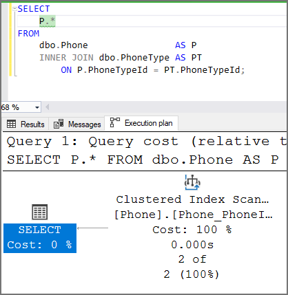
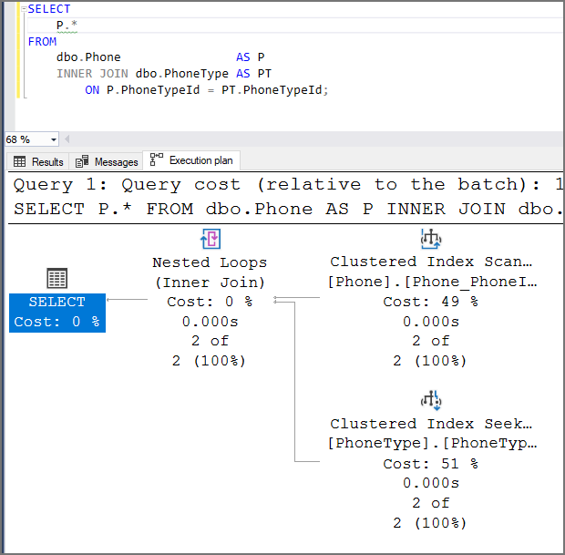
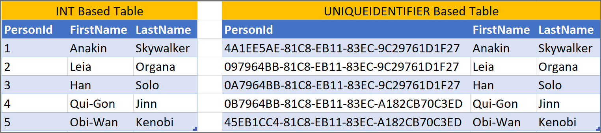

# Table Conventions
{: .no_toc }
Table design matters because it is essential for building software applications that are scalable and capable of performing during high workload.

---

<details open markdown="block">
  <summary>
    Table of contents
  </summary>
  {: .text-delta }
1. TOC
{:toc}
</details>

[Back to top](#top)

---

<a name="147"/>

## Incorrect Inheritance Type
**Check Id:** 147 [Not implemented yet. Click here to add the issue if you want to develop and create a pull request.](https://github.com/EmergentSoftware/SQL-Server-Development-Assessment/issues/new?assignees=&labels=enhancement&template=feature_request.md&title=Incorrect+Inheritance+Type)

Use the [Table Per Type (TPT)](https://entityframework.net/tpt) table design pattern.

The [Table Per Concrete (TPC)](https://entityframework.net/tpc) design is not good as it would have redundant data and no relationship between the sub tables. The redundant data would just be in multiple tables vs squished into one table with [Table Per Hierarchy (TPH)](https://entityframework.net/tph). TPC would help with the extra nullable columns compared to TPH.

The [Table Per Type (TPT)](https://entityframework.net/tpt) table design pattern is performant with proper indexes well into the 100s of millions of rows and beyond. With proper indexes a query can join multiple tables and still execute in less than a second even for costly queries that scan indexes like exporting of data. Seeking on indexes for row-level queries like finding a specific CustomerId, should only take on order of 10s of milliseconds. Until multiple of billions of rows are a consideration there is no performance reason not to follow database norm form best practices. If you have slow joined table queries, you're probably not using your database correctly.

TPC & TPH do not follow normal form. 

- See [Not Normalizing Tables](#not-normalizing-tables).

[Back to top](#top)

---

<a name="148"/>

## Using Entity Attribute Value
**Check Id:** 148 [Not implemented yet. Click here to add the issue if you want to develop and create a pull request.](https://github.com/EmergentSoftware/SQL-Server-Development-Assessment/issues/new?assignees=&labels=enhancement&template=feature_request.md&title=Using+Entity+Attribute+Value)

The [Entity–Attribute–Value (EAV) model ](https://en.wikipedia.org/wiki/Entity%E2%80%93attribute%E2%80%93value_model) falls victim to the [Inner-platform effect](https://en.wikipedia.org/wiki/Inner-platform_effect).

The inner-platform effect is the tendency of software architects to create a system so customizable as to become a replica, and often a poor replica, of the software development platform they are using. This is generally inefficient and such systems are often considered to be examples of an [anti-pattern](https://en.wikipedia.org/wiki/Anti-pattern).

In the database world, developers are sometimes tempted to bypass the SQL Server relations database, for example by storing everything in one big table with three columns labelled EntityId, Key, and Value. While this entity-attribute-value model allows the developer to break out from the structure imposed by a SQL Server database, it loses out on all the benefits, since all of the work that could be done efficiently by the SQL Server relational database is forced onto the application instead. Queries become much more convoluted, the indexes and query optimizer can no longer work effectively, and data validity constraints are not enforced. Performance and maintainability can be extremely poor.

**Use Case Exceptions**

Data that meets the following criteria might be okay to use the EAV pattern at the discretion of the software or database architect.
- The definition of the data is highly dynamic and is likely to change numerous times of the course of the development and/or life of the application.
- The data has no intrinsic value outside the context of the application itself.
- The data will not be materialized in models but simply passed through the application layers as key value pairs.

Examples of valid use cases that meet this criteria are:
- Application user preferences
- User interface styling & custom layouts
- Saved user interface state
- Front-end application configuration

Another use case exception for utilizing an EAV model in a database is where the attributes are user defined and a developer will not have control over them.

Another use case exception for utilizing an EAV model is for something like a multiple product (entity) type shopping cart. Where each specific product (entity) type has its own list of attributes. If the product (entity) catalog only sells a manageable number of product different types the attributes, the attributes should be materialized as physical columns in the table schema. This type of EAV model will have diminishing returns for performance with more data housed in the database. Caching this type of EAV model will allow for a larger data set as to lessen the chance of performance issues. Ensure this is communicated to the stakeholders.

**Basic table model for a product catalog that supports multiple product types**

```sql
CREATE TABLE dbo.Attribute (
    AttributeId   int           IDENTITY(1, 1) NOT NULL
   ,AttributeName nvarchar(100) NOT NULL
   ,CONSTRAINT Attribute_AttributeId PRIMARY KEY CLUSTERED (AttributeId ASC)
);

/* Insert values like "Size", "Color" */


CREATE TABLE dbo.AttributeTerm (
    AttributeTermId int           IDENTITY(1, 1) NOT NULL
   ,AttributeId     int           NOT NULL CONSTRAINT AttributeTerm_Attribute FOREIGN KEY REFERENCES dbo.Attribute (AttributeId)
   ,TermName        nvarchar(100) NOT NULL
   ,CONSTRAINT AttributeTerm_AttributeTermId PRIMARY KEY CLUSTERED (AttributeTermId ASC)
);

/* Insert values like "Small", "Large", "Red", "Green" */


CREATE TABLE dbo.Product (
    ProductId          int           IDENTITY(1, 1) NOT NULL
   ,ProductName        nvarchar(200) NOT NULL
   ,ProductSlug        nvarchar(400) NOT NULL
   ,ProductDescription nvarchar(MAX) NULL
   ,CONSTRAINT Product_ProductId PRIMARY KEY CLUSTERED (ProductId ASC)
   ,CONSTRAINT Product_ProductName UNIQUE NONCLUSTERED (ProductName ASC)
   ,CONSTRAINT Product_ProductSlug UNIQUE NONCLUSTERED (ProductSlug ASC)
);

/* Insert values like "Shirt", "Pants" */


CREATE TABLE dbo.ProductItem (
    ProductItemId int            IDENTITY(1, 1) NOT NULL
   ,ProductId     int            NOT NULL CONSTRAINT ProductItem_Product FOREIGN KEY REFERENCES dbo.Product (ProductId)
   ,UPC           varchar(12)    NULL
   ,RegularPrice  decimal(18, 2) NOT NULL
   ,SalePrice     decimal(18, 2) NULL
   ,CONSTRAINT ProductItem_ProductItemId PRIMARY KEY CLUSTERED (ProductItemId ASC)
);

/* Insert values product UPC codes and prices */


CREATE TABLE dbo.ProductVariant (
    ProductVariantId int IDENTITY(1, 1) NOT NULL
   ,ProductItemId    int NOT NULL CONSTRAINT ProductVariant_ProductItem FOREIGN KEY REFERENCES dbo.ProductItem (ProductItemId)
   ,AttributeTermId  int NOT NULL CONSTRAINT ProductVariant_AttributeTerm FOREIGN KEY REFERENCES dbo.AttributeTerm (AttributeTermId)
   ,CONSTRAINT ProductVariant_ProductVariantId PRIMARY KEY CLUSTERED (ProductVariantId ASC)
);

/* Insert values that link Shirt or Pants product items to the attributes available for sale */
```

[Back to top](#top)

---

<a name="149"/>

## Incorrect Weak or Strong Table
**Check Id:** 149 [Not implemented yet. Click here to add the issue if you want to develop and create a pull request.](https://github.com/EmergentSoftware/SQL-Server-Development-Assessment/issues/new?assignees=&labels=enhancement&template=feature_request.md&title=Incorrect+Weak+or+Strong+Table)

Use the proper weak or strong table type based on the entity.

A weak table is one that can only exist when owned by another table. For example: a 'Room' can only exist in a 'Building'.

An 'Address' is a strong table because it exists with or without a person or organization.

With an 'Address' table you would have a linking, or many-to-many table.

|ResidenceId|AddressTypeId|PersonId|AddressId|
|--|--|--|--|
|1|1|456|233|
|2|1|234|167|
|3|2|622|893|


A 'Phone Number' is a weak table because it generally does not exist without a person or organization.

With a 'Phone Number' table you would not use a linking table. The 'Phone Number' table would reference back to the person table.

|PersonId|FistName|LastName|
|--|--|--|
|1|Kevin|Martin|
|2|Han|Solo|
|3|Mace|Windu|

|PersonPhoneId|PhoneTypeId|PersonId|PhoneNumber|
|--|--|--|--|
|1|1|1|555-899-5543|
|2|1|2|(612) 233-2255|
|3|2|3|1+ (453) 556-9902|

An entity is a table and is a single set of attributes. There is a need sometimes for entity/table inheritance when you might have a parent entity/table named `Person`, you would need another inherited entity/table for `Employee`. The `Employee` entity/table will store attributes (Salary, Job Title, ...) that are not attributes in the `Person` entity/table.


Table Entity Use Case Exception
A use case exception for using proper table entities is for security purposes. You might encounter a requirement for security that utilizing a linking table makes it impossible to have a discriminator like `PhoneTypeId` to prevent read or modifications to a row based on how the software was/is written.

This exception use can lead to table schema development issues for cases when you have a multiple entity/tables like `dbo.BuyerPhone`, `dbo.SellerPhone`, `dbo.ServicerPhone`, `dbo.VendorPhone`. With the address entity not being materialized in one `dbo.Phone` entity/table, the table schemas need to be kept in sync which might not occur. Ask me how I know. ;-(


[Back to top](#top)

---

<a name="150"/>

## Nullable Columns with No Non-Null Records
**Check Id:** 150 [Not implemented yet. Click here to add the issue if you want to develop and create a pull request.](https://github.com/EmergentSoftware/SQL-Server-Development-Assessment/issues/new?assignees=&labels=enhancement&template=feature_request.md&title=Nullable+Columns+with+No+Non-Null+Records)

If the row data in the table does not contain any ```NULL``` values you should assess setting the column to not 'Allow Nulls'.

Null-ness does more than constraining the data, it factors in on performace optimizer decisions.

For data warehouses do not allow ```NULL``` values for dimensional tables. You can create a -1 identifier with the value of [UNKNOWN]. This helps business analysts who might not understand the difference between INNER and OUTER JOINs exclude data in their TSQL queries.

### Nullable Columns and JOIN Elimination

If a column has a foreign key and nullable, it will not be trusted and ```JOIN``` Elimination will not occur, forcing your query to perform more query operations than needed.

This execution plan shows how ```JOIN``` elimination works. There is a foreign key on the column and the column does not allow null. There is only one index operation in the execution plan. SQL Server is able to eliminate JOINs because it "trusts" the data relationship.

- See [Untrusted Foreign Key](#untrusted-foreign-key)



This execution plan shows ```JOIN``` elimination has not occurred. While there is a foreign key on the column, the column allows null. There are two index operations and a merge operation causing SQL Server to perform more work.




[Back to top](#top)

---

<a name="31"/><a name="column-named-id-but-no-foreign-key-exists"/>

## Column Named ????Id But No FK Exists
**Check Id:** 31

In most cases, columns with the name ????Id that are not the primary key should have a foreign key relationship to another table.

You will not get JOIN Eliminations without a foreign key and a column that allows NULLs.

- See [Nullable Columns and JOIN Elimination](#nullable-columns-and-join-elimination) 

[Back to top](#top)

---

<a name="157"/>

## Using Table Partitions
**Check Id:** 157

Database table partitions should not be used to "speed up" query performance. Use an index instead.

Partitioning can make your workload run slower if the partitions are not set up correctly and your queries cannot remain within a single partition. Instead of thinking about a partition, think about an index.

Partitioning can be used as a maintenance tool for either distributing data between cold or hot storage. 

Partition switching/swapping/truncating is another use case for managing large amounts of table data like in a data warehouse.


[Back to top](#top)

---

<a name="151"/>

## Using Cascading Actions on Foreign Key
**Check Id:** 151 [Not implemented yet. Click here to add the issue if you want to develop and create a pull request.](https://github.com/EmergentSoftware/SQL-Server-Development-Assessment/issues/new?assignees=&labels=enhancement&template=feature_request.md&title=Using+Cascading+Actions+on+Foreign+Key)

Use a stored procedure or SQL command in your software code to delete data in multiple related tables instead of `ON DELETE CASCADE` on the foreign key.

Foreign keys with cascading actions like `ON DELETE CASCADE` or `ON UPDATE ?` perform slowly due to SQL Server taking out serializable locks (RANGEX-X) to guarantee referential integrity so that it can trust the foreign keys.

You may also receive the error message below when you utilize `ON DELETE CASCADE`.

```
Msg 1785, Level 16, State 0, Line 190
Introducing FOREIGN KEY constraint [ForeignKeyName] on table [TableName] may cause cycles or multiple cascade paths.
Specify ON DELETE NO ACTION or ON UPDATE NO ACTION, or modify other FOREIGN KEY constraints.
Msg 1750, Level 16, State 1, Line 190
Could not create constraint or index. See previous errors.
```

[Back to top](#top)

---

<a name="152"/>

## NULL or NOT NULL Option is not Specified in CREATE or DECLARE TABLE
**Check Id:** 152 [Not implemented yet. Click here to add the issue if you want to develop and create a pull request.](https://github.com/EmergentSoftware/SQL-Server-Development-Assessment/issues/new?assignees=&labels=enhancement&template=feature_request.md&title=NULL+or+NOT+NULL+option+is+not+specified+in+CREATE+or+DECLARE+TABLE)

You should always explicitly define ``NULL`` or ``NOT NULL`` for columns when creating or declaring a table. The default of allowing NULLs can be changed with the database setting ``ANSI_NULL_DFLT_ON``.

[Back to top](#top)

---
<a name="153"/>

## ASC or DESC is Not Specified
**Check Id:** 153 [Not implemented yet. Click here to add the issue if you want to develop and create a pull request.](https://github.com/EmergentSoftware/SQL-Server-Development-Assessment/issues/new?assignees=&labels=enhancement&template=feature_request.md&title=ASC+or+DESC+is+Not+Specified)

You should always explicitly define ascending (``ASC``) or descending (``DESC``). This allows others who review or edit the code to not know that ``ASC`` is the default sort order.

[Back to top](#top)

---

<a name="29"/><a name="using-unique-constraint-instead-of-unique-indexes"/>

## Unique Constraint or Unique Indexes Usage
**Check Id:** 29

Create unique indexes instead of unique constraints (unique key). Doing so removes a dependency of a unique key to the unique index that is created automatically and tightly coupled.

**Instead of:** ```CONSTRAINT AddressType_AddressTypeName_Unique UNIQUE (AddressTypeName ASC)```

**Use:** ```INDEX AddressType_AddressTypeName UNIQUE NONCLUSTERED (AddressTypeName ASC)```

In some table design cases you might need to create uniqueness for one or more columns. This could be for a natural [composite] key or to ensure a person can only have one phone number and phone type combination.

There is no functional or performance difference between a unique constraint (unique key) and a unique index. With both you get a unique index, but with a unique constraint (unique key) the 'Ignore Duplicate Keys' and 'Re-compute statistics' index creation options are not available.

The only possible benefit of a unique constraint (unique key) has over a unique index is to emphasize the purpose of the index and is displayed in the SSMS (SQL Server Management Studio) table 'Keys' folder in the 'Object Explorer' side pane.

- See [Naming Constraint Usage](/SQL-Server-Development-Assessment/best-practices-and-potential-findings/naming-conventions#naming-constraint-usage)

[Back to top](#top)

---

<a name="32"/>

## More Than 5 Indexes
**Check Id:** 32

Your table might be over indexed. The more you have the less performant insert, update & deletes are. A general rule of thumb is 5 indexes on a table.

A general rule is to aim for 5 indexes per table, with around 5 columns or less on each index. This is not a set-in-stone rule, but if you go beyond the general rule you should ensure you are only creating indexes that are required for the SQL Server query workload. If you have a read-only database, there will be no inserts, updates, or deletes to maintain on all those indexes.

You or your DBA should implement an index tuning strategy like below.

1. **Dedupe** - reduce overlapping indexes
2. **Eliminate** - unused indexes
3. **Add** - badly needed missing indexes
4. **Tune** - indexes for specific queries
5. **Heap** - usually need clustered indexes

[Back to top](#top)

---

<a name="33"/>

## Less than 2 Indexes
**Check Id:** 33

Your table might be under indexed. Would an index on any other column make your queries go faster?

[Back to top](#top)

---

<a name="34"/>

## Disabled Index
**Check Id:** 34

An index rebuild or reorganization will enabled disabled indexes. It is now best practices to delete instead of disable if not needed.

[Back to top](#top)

---

<a name="35"/>

## Leftover Fake Index
**Check Id:** 35

The Index Tuning Wizard and Database Tuning Advisor create fake indexes, then getting a new execution plan for a query. These fake indexes stay behind sometimes.

To fix the issue `DROP` the indexes.

There are better ways to performance tune than using the wizards.

[Back to top](#top)

---

<a name="154"/>

## Filter Columns Not In Index Definition
**Check Id:** 154 [Not implemented yet. Click here to add the issue if you want to develop and create a pull request.](https://github.com/EmergentSoftware/SQL-Server-Development-Assessment/issues/new?assignees=&labels=enhancement&template=feature_request.md&title=Filter+Columns+Not+In+Index+Definition)

Add the filtered columns in the ```INCLUDE()``` on your index so your queries do not need to perform a key lookup. By including the filtered columns, SQL Server generates statistics on the columns.

**Instead Of:**

```sql
CREATE NONCLUSTERED INDEX Account_Greater_Than_Half_Million
    ON dbo.Account (AccountName, AccountId)
    WHERE Balance > 500000;
```

**Do This:**

```sql
CREATE NONCLUSTERED INDEX Account_Greater_Than_Half_Million
    ON dbo.Account (AccountName, AccountId)
    INCLUDE (Balance)
    WHERE Balance > 500000;
```

[Back to top](#top)

---

<a name="36"/>

## Column Has a Different Collation Than Database
**Check Id:** 36

This could cause issues if the code is not aware of different collations and does include features to work with them correctly.

[Back to top](#top)

---

<a name="37"/>

## Low Index Fill-Factor
**Check Id:** 37

The default fill factor is (100 or 0) for SQL Server. This check is alerting you to a fill factor of 80% or lower.

Best practice is to ONLY use a low fill factor on indexes where you know you need it. Setting a low fill factor on too many indexes will hurt your performance:

- Wasted space in storage
- Wasted space in memory (and therefore greater memory churn)
- More IO, and with it higher CPU usage

Review indexes diagnosed with low fill factor. Check how much they’re written to. Look at the keys and determine whether insert and update patterns are likely to cause page splits.

[Back to top](#top)

---

<a name="38"/><a name="untrusted-foreign-key"/><a name="untrusted-check-constraints"/>

## Untrusted Foreign Key or Check Constraints
**Check Id:** 38

SQL Server is not going to consider using untrusted constraints to compile a better execution plan. This can have a huge performance impact on your database queries.

You might have disabled a constraint instead of dropping and recreating it for bulk loading data. This is fine, as long as your remember to enable it correctly.

[If you don't specify, WITH CHECK is assumed for new constraints, and WITH NOCHECK is assumed for re-enabled constraints](https://docs.microsoft.com/en-us/sql/t-sql/statements/alter-table-transact-sql?redirectedfrom=MSDN&view=sql-server-ver16#with-check--with-nocheck).

```sql
ALTER TABLE dbo.TableName WITH CHECK CHECK CONSTRAINT ConstraintName;
GO
```

The `CHECK CHECK` syntax is correct. The 1st `CHECK` is the end of `WITH CHECK` statement. The 2nd `CHECK` is the start of the `CHECK CONSTRAINT` clause to enable the constraint

To find untrusted foreign keys and check constraints in your database run the script below to identify and create an ``ALTER`` statement to correct the issue. In Redgate SQL Prompt the snippet code is ``fk``. If you receive an error with the generated ``ALTER`` statement it means past constraint violations have been being suppressed by ``WITH NOCHECK``. You will have to figure out how to fix the rows that do not comply with the constraint.

```sql
SELECT
    SchemaName = S.name
   ,TableName  = T.name
   ,ObjectName = FK.name
   ,ObjectType = 'FOREIGN KEY'
   ,FixSQL     = 'ALTER TABLE ' + QUOTENAME(S.name) + '.' + QUOTENAME(T.name) + ' WITH CHECK CHECK CONSTRAINT ' + FK.name + ';'
FROM
    sys.foreign_keys       AS FK
    INNER JOIN sys.tables  AS T
        ON FK.parent_object_id = T.object_id
    INNER JOIN sys.schemas AS S
        ON T.schema_id         = S.schema_id
WHERE
    FK.is_not_trusted         = 1
AND FK.is_not_for_replication = 0

UNION ALL

SELECT
    SchemaName = S.name
   ,TableName  = T.name
   ,ObjectName = CC.name
   ,ObjectType = 'CHECK CONSTRAINT'
   ,FixSQL     = 'ALTER TABLE ' + QUOTENAME(S.name) + '.' + QUOTENAME(T.name) + ' WITH CHECK CHECK CONSTRAINT ' + CC.name + ';'
FROM
    sys.check_constraints  AS CC
    INNER JOIN sys.tables  AS T
        ON CC.parent_object_id = T.object_id
    INNER JOIN sys.schemas AS S
        ON T.schema_id         = S.schema_id
WHERE
    CC.is_not_trusted         = 1
AND CC.is_not_for_replication = 0
AND CC.is_disabled            = 0
ORDER BY
    SchemaName ASC
   ,TableName ASC
   ,ObjectName ASC;
```

[Back to top](#top)

---

<a name="40"/>

## Disabled Check Constraint
**Check Id:** 40

You should check to see if it was on purpose that you have a disabled check constraint.

[Back to top](#top)

---

<a name="41"/>

## Unrelated to Any Other Table
**Check Id:** 41

This is just a sanity check to let you know there is a table that does not have any foreign keys. This can be ok, but it is normally unlikely seeing you are using a relational database. 😉

[Back to top](#top)

---

<a name="22"/>

## uniqueidentifier in a Clustered Index
**Check Id:** 22

``uniqueidentifier/guid`` columns should not be in a clustered index. Even NEWSEQUENTIALID() should not be used in a clustered index. The sequential ``uniqueidentifier/guid`` is based on the SQL Server's MAC address. When an Availability Group fails over the next ``uniqueidentifier/guid`` will not be sequential anymore.

SQL Server will bad page split and fragment an index when a new record is inserted instead of being inserting on the last page using standard best practices for index maintenance. The clustered index will become fragmented because of randomness of ``uniqueidentifier/guid``. Index maintenance set to the default fill factor of 0 (packed 100%) will force bad page splits.

A use case for when you can use ``uniqueidentifier/guid`` as a primary key & clustered index, is when there are separate systems and merging rows would be difficult. The uniqueness of ``uniqueidentifier/guid`` simplifies the data movements.

DBAs have historically not implemented ``uniqueidentifier/guid`` as primary keys and/or clustered indexes. The traditional index maintenance jobs would keep the ``uniqueidentifier/guid`` indexes in a perpetual state of fragmentation causing bad page splits, which is an expensive process.

A new index maintenance strategy is to name these ``uniqueidentifier/guid`` indexes with the ending "*_INDEX_REBUILD_ONLY" and create a customized index maintenance plan. One job step will perform the standard index maintenance ignoring the ``uniqueidentifier/guid`` indexes and another job step will only perform an index rebuild, skipping index reorganizations. [Ola Hallengren maintenance scripts](https://ola.hallengren.com/) is recommended.

These ``uniqueidentifier/guid`` indexes should be created and rebuilt with a custom fill factor to account for at least a weeks' worth of data. This is not a "set it, and forget it" maintenance plan and will need some looking after.

These are a 400 level tasks and please feel free to reach out to a DBA for assistance.

[Back to top](#top)

---

<a name="21"/>

## Missing Index for Foreign Key
**Check Id:** 21

Each foreign key in your table should be included in an index in the primary key position. If you have a `UNIQUE NONCLUSTERED` index with multiple keys, ensure foreign key columns not in the primary key location also get their own `NONCLUSTERED` index in the primary key position.

Start off with an index on just the foreign key column if you have no workload to tune a multi-column index. There is a real good chance the indexes will be used when queries join on the parent table.

[Back to top](#top)

---

<a name="20"/>

## Missing Primary Key
**Check Id:** 20

Every table should have some column (or set of columns) that uniquely identifies one and only one row. It makes it much easier to maintain the data.

[Back to top](#top)

---

<a name="8"/>

## uniqueidentifier For Primary Key
**Check Id:** 8

Using ``uniqueidentifier/guid`` as primary keys causes issues with SQL Server databases. ``uniqueidentifier/guid`` are unnecessarily wide (4x wider than an INT).

``uniqueidentifiers/guids`` are not user friendly when working with data. PersonId = 2684 is more user friendly then PersonId = 0B7964BB-81C8-EB11-83EC-A182CB70C3ED.




A use case for when you can use ``uniqueidentifier/guid`` as primary keys, is when there are separate systems and merging rows would be difficult. The uniqueness of ``uniqueidentifier/guid`` simplifies the data movements.

- See [uniqueidentifier in a Clustered Index](#uniqueidentifier-in-a-clustered-index)

[Back to top](#top)

---

<a name="3"/>

## Wide Table
**Check Id:** 3

Do you have more than 20 columns? You might be treating this table like a spreadsheet. You might need to redesign your table schema.

[Back to top](#top)

---

<a name="6"/>

## Heap
**Check Id:** 6

Add a clustered index.

SQL Server storage is built around the clustered index as a fundamental part of the data storage and retrieval engine. The data itself is stored with the clustered key. All this makes having an appropriate clustered index a vital part of database design. The places where a table without a clustered index is preferable are rare; which is why a missing clustered index is a common code smell in database design.

A 'table' without a clustered index is a heap, which is a particularly bad idea when its data is usually returned in an aggregated form, or in a sorted order. Paradoxically, though, it can be rather good for implementing a log or a ‘staging’ table used for bulk inserts, since it is read very infrequently, and there is less overhead in writing to it. 

A table with a non-clustered index, but without a clustered index can sometimes perform well even though the index must reference individual rows via a Row Identifier rather than a more meaningful clustered index. The arrangement can be effective for a table that isn’t often updated if the table is always accessed by a non-clustered index and there is no good candidate for a clustered index.

Heaps have performance issues like table scans, forward fetches.

[Back to top](#top)

---

<a name="155"/>

## Not Normalizing Tables
**Check Id:** 155 [Not implemented yet. Click here to add the issue if you want to develop and create a pull request.](https://github.com/EmergentSoftware/SQL-Server-Development-Assessment/issues/new?assignees=&labels=enhancement&template=feature_request.md&title=Not+Normalizing+Tables)

[Database Normalizing](https://en.wikipedia.org/wiki/Database_normalization) tables is regarded as a best practice methodology for relational databases design. Relational database tables should be normalized to at least the [Boyce–Codd normal form (BCNF or 3.5NF)](https://en.wikipedia.org/wiki/Boyce%E2%80%93Codd_normal_form).

These normalizing principles are used to reduce data duplication, avoid data anomalies, ensure table relationship integrity, and make data management simplified.

A normalize table design like addresses and phone numbers in separate tables allows for extensibility when the requirements today might only call for a single phone number or address. You can utilize a ``UNIQUE`` constraint/index to ensure only a single row can exist but allows for flexibility in the future. You will already have the Phone table so you will not have to create a new table and migrate the data and drop the ``UNIQUE`` constraint/index.

You should always normalize the database schema unless you have a really good reason not to. Denormalizing has been performed in the past with the saying "Normalize until it hurts, denormalize until it works". Denormalization almost always leads to eventual issues. Denormalization complicates updates, deletes & inserts making the database difficult to modify. We have tools like indexes or materialized views and covering indexes to remediate performance issues. There are query rewriting techniques that can make queries more performant. 

A legally binding entity like a contract that will be created as an immutable snapshot can contain redundant data. This helps with possible future reprinting of documents. Consider using an auditable append-only Ledger table.

If data is denormalized there are methods of keeping denormalized or duplicated data values correct. The data should be strongly consistency instead of eventually consistent.

Strongly consistent is with the use of transactions that will not allow the data to be out-of-sync like in stored procedure, triggers are the next best option, but triggers have performance issues.

Eventually consistent methods are something like jobs that run at a predetermined or event-based time to sync the denormalized (duplicate) data. Eventually consistent leaves a gap of time, even if for milliseconds, that could cause data consistency issues.

- See [Keeping Denormalized Values Correct](http://database-programmer.blogspot.com/2008/11/keeping-denormalized-values-correct.html) article by Kenneth Downs

[Back to top](#top)

---

<a name="30"/>

## System Versioned Temporal Tables are not Compressed
**Check Id:** 30

By default, the history table is PAGE compressed for System Versioned Temporal Tables.

The SQL script below will check for the issue and provide an ALTER TSQL statement to apply page compression. Do not forget to change ONLINE to ON OR OFF.

```sql
SELECT
    SchemaName      = S.name
   ,TableName       = T.name
   ,DataCompression = P.data_compression_desc
   ,[ALTER TSQL]    = N'ALTER INDEX ' + CAST(QUOTENAME(I.name) AS nvarchar(128)) + N' ON ' + CAST(QUOTENAME(S.name) AS nvarchar(128)) + N'.' + CAST(QUOTENAME(T.name) AS nvarchar(128)) + N' REBUILD PARTITION = ALL WITH (STATISTICS_NORECOMPUTE = OFF, ONLINE = ?, DATA_COMPRESSION = PAGE);'
FROM
    sys.partitions         AS P
    INNER JOIN sys.indexes AS I
        ON I.object_id = P.object_id
        AND I.index_id = P.index_id
    INNER JOIN sys.objects AS O
        ON I.object_id = O.object_id
    INNER JOIN sys.tables  AS T
        ON O.object_id = T.object_id
    INNER JOIN sys.schemas AS S
        ON T.schema_id = S.schema_id
WHERE
    T.temporal_type    = 1 /* HISTORY_TABLE */
AND I.type             <> 5 /* CLUSTERED */
AND P.data_compression <> 2 /* Not Page compressed, which is the default for system-versioned temporal tables */
ORDER BY
    S.name ASC
   ,T.name ASC;
```

[Back to top](#top)

---
<br>
<br>
<br>
<br>
<br>
<br>
<br>
<br>
<br>
<br>
<br>
<br>
<br>
<br>
<br>
<br>
<br>
<br>
<br>
<br>
<br>
<br>
<br>
<br>
<br>
<br>
<br>
<br>
<br>
<br>
<br>
<br>
<br>
<br>
<br>
<br>
<br>